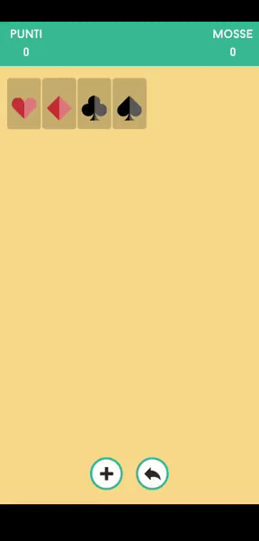

# CardGame
Simple solitaire, made in a week for a challange.

Stack the cards of each suit starting with the ace in as few moves as possible.
Arrange the cards on the table in inverted colors and retrieve from the top deck if you have no more moves available.
You can also undo your action, but be careful, it will be count as a move!

